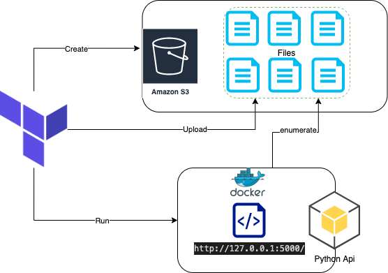

# Terraform Object Storage
Terraform code to create and upload object storage

## Define Access key and Secret key and desired bucket name to create.
```
export TF_VAR_access_key=XXXXXX
export TF_VAR_secret_key=XXXXX
export TF_VAR_bucketname=XXXXX
```
>If bucket name not provided the configuration will try to create bucket named `atestbucket`

Update region and bucket name for the sample app in `variables.tf` and execute

```
terraform plan && terraform apply
```
Files under the directory `filestoupload` will be uploaded to the newly created s3 bucket.

## docker.tf
After uploading the files, terraform will execute a docker command to run an api that will enumerate the objects inside of your S3 bucket.

Image which it pulls can be found [here](https://hub.docker.com/repository/docker/mazishah/python-enumrate-api)
Source code can be found [here](https://github.com/maaz-shah/python-enumerate-api)

Flask wil run on port 5000
http://127.0.0.1:5000/

